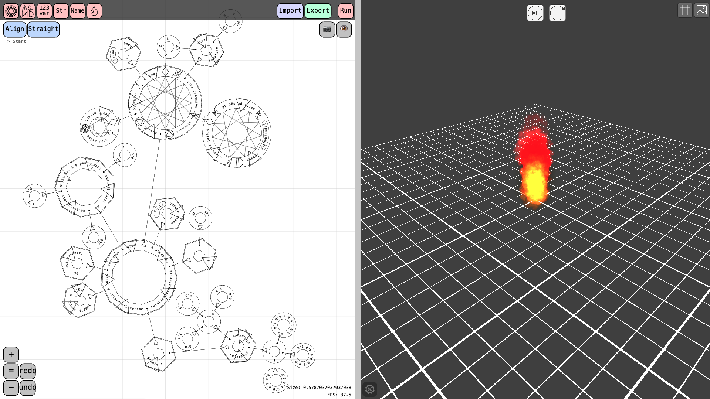
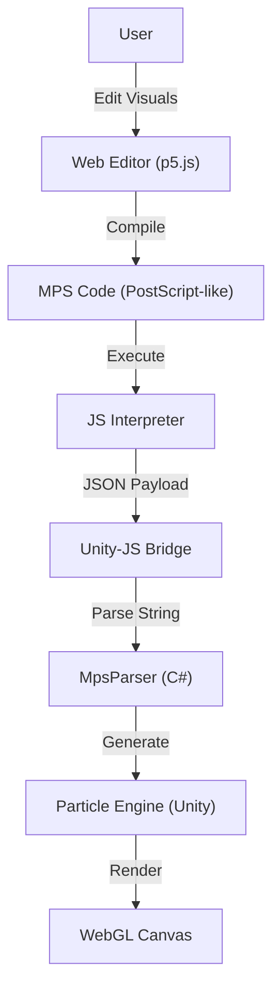

# MagicEditor: Visual Magic Programming Environment



## 📖 概要 (Overview)

**MagicEditor** は、アニメやファンタジー作品に登場する「魔法陣」を構築し、実際に**実行可能なプログラム**として動作させるためのビジュアルプログラミング環境です。

ユーザーはWebブラウザ上のエディタで「リング（魔法円）」と「シジル（魔法文字）」を組み合わせてロジックを記述します。その結果は独自のスタックベース言語（**MPS: Magic Particle Script**）にコンパイルされ、Unityエンジン上でリアルタイムに**パーティクルエフェクトとして生成・実行**されます。

「見た目だけの魔法陣」ではなく、**論理構造と視覚効果が完全にリンクした「魔法工学」の実装**を目指しています。

## ✨ 主な特徴 (Key Features)

### 1. ビジュアル・スタックマシン (Visual Stack Machine)

* **リング構造**: プログラミングにおける「スコープ」や「配列」を円環構造で表現。

* **シジル**: `add`, `sub`, `sin` などの演算命令や、`fire`, `barrier` などの魔法効果を象形文字として配置。

* **ジョイント接続**: リング同士を接続し、データの受け渡しやサブルーチンの実行フローを視覚化。

### 2. リッチなデータエディタ (Rich Data Editors)

魔法のパラメータを直感的に調整するための専用UIを搭載しています。

* **🎨 カラーピッカー**: RGBA/HSV対応。

* **🌈 グラディエントエディタ**: パーティクルの色変化を詳細に設定可能。

* **📈 カーブエディタ**: ベジェ曲線/Catmull-Romスプラインを用いた、時系列パラメータの制御。

### 3. 高度なパーティクル制御 (Procedural Particle Synthesis)

Unity標準のParticle Systemを、スクリプトから動的に構築します。プリセットを再生するのではなく、**すべてのパラメータ（発生数、形状、ライフタイム、ノイズ、衝突判定など）をランタイムで生成**するため、無限のバリエーションを作成可能です。

### 4. 独自言語 "MPS" (Magic Particle Script)

PostScriptに影響を受けた、独自のスタック指向言語を実装。

* **JSインタプリタ**: ブラウザ上で動作し、ロジック演算や辞書操作を担当。

* **Unityパーサー**: テキストとして送られたパーティクル定義を解析し、C#のデータ構造に変換。

## 🏗 アーキテクチャ (Architecture)

プロジェクトは「Webエディタ（Frontend）」と「実行エンジン（Unity）」の2層構造で動作します。



### システム構成要素

1. **Frontend / Editor (`.js`, p5.js)**

   * ユーザー入力を受け付け、リング構造データ（`MagicRing`）を管理。

   * ビジュアルプログラミングの結果をMPSコード（文字列）に変換。

2. **Core Interpreter (`interpreter.js`)**

   * カスタム実装されたスタックマシン。

   * `spawnobj`, `magicactivate` などの描画命令が呼ばれると、パラメータをJSON化してUnityへ送信。

3. **Parser & Engine (`.cs`, Unity)**

   * **`JsCallbackHandler`**: ブラウザからのメッセージを受信。

   * **`MpsParser`**: 受信した独自構文の文字列（例: `< ~rateOverTime ... >`）を字句解析し、C#の構造体へ変換。

   * **`ParticleGenerator`**: 解析データを元に `ParticleSystem` コンポーネントを動的に生成・設定。

## 🛠 技術スタック (Tech Stack)

### Frontend (Web Editor)

* **Language**: JavaScript (ES6+)

* **Framework**: [p5.js](https://p5js.org/) (Rendering & UI)

* **Styling**: CSS3 (Custom Panels, Dark Theme)

### Backend (Execution Engine)

* **Engine**: Unity 2021.3+ (WebGL Build)

* **Language**: C#

* **Key Components**:

  * `ParticleSystem` (Runtime Modification)

  * Custom Tokenizer/Scanner (for MPS parsing)

### Data / Communication

* **Format**: XML (Save/Load), JSON (Bridge), Custom MPS Syntax

* **Method**: `SendMessage` (Unity WebGL Interop)

## 🚀 インストールと実行 (Installation & Usage)

本プロジェクトはWebブラウザ上で動作するように設計されています。

1. **リポジトリのクローン**:

   ```bash
   git clone [https://github.com/utomasato/MagicEditor.git](https://github.com/utomasato/MagicEditor.git)
   ```
2. **ローカルサーバーの起動**:

   * Unityビルド済みの `index.html` があるディレクトリでサーバーを立ち上げます。

   * 例 (VS Code): "Live Server" 拡張機能を使用。

   * 例 (Python): `python -m http.server 8000`

3. **ブラウザでアクセス**:

   * `http://localhost:8000` を開くとエディタが起動します。

## 🎮 基本的な使い方 (Basic Usage)

1. **リングの追加**: キャンバスを右クリックし、メニューから「Ring」を選択。

2. **魔法の構築**:

   * リング上に「Sigil」（数値や演算子）を追加。

   * テンプレートリング（`TemplateRing`）を使うと、「Fire」や「Bullet」などの定義済み魔法をすぐに呼び出せます。

3. **実行**:

   * 画面左上の「Run」ボタン（再生マーク）をクリック。

   * 解釈されたコードがUnityへ送られ、魔法が発動します。

4. **保存**:

   * 「Export」ボタンでXML形式として保存可能。「Import」で復元できます。

## 🤝 今後の展望 (Roadmap)

* [ ] パーティクル以外のUnity機能（ライト、物理演算）へのアクセス拡張。

* [ ] シェーダーグラフとの連携強化。

## 🙏 謝辞・参考プロジェクト (Acknowledgments & Inspiration)

本プロジェクトの言語設計（PostScriptベースの魔法記述）およびコンセプトは、以下のオープンソースプロジェクトに強くインスパイアされています。
先駆的なアイデアと実装に深く感謝と敬意を表します。

* [**mystical_ps**](https://github.com/denismm/mystical_ps)

  * **Author**: [denismm](https://github.com/denismm)

  * **License**: [MIT License](https://github.com/denismm/mystical_ps/blob/main/LICENSE.md)
